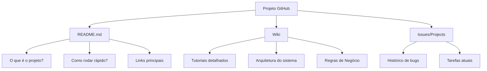

# Aula 03 – O Poder da Documentação: WikIs, READMEs e Bases de Conhecimento

---

## 🎯 Objetivo da Aula

- Compreender a importância da documentação para a manutenção de software.
- Aprender a diferença entre README, Wiki e Documentação Técnica.
- Dominar o uso do **GitHub Wiki** para criar uma base de conhecimento.
- Praticar a escrita técnica estruturada com **Markdown**.

---

## 🖼️ O que é Documentação?

Imagine que você recebeu um conjunto de peças de LEGO super complexo, mas **sem o manual**. Você até consegue montar algo, mas vai demorar muito mais, cometer erros e talvez nunca chegue ao resultado esperado.

No software, a documentação é o nosso **Manual e GPS**.

*A documentação transforma caos em conhecimento estruturado.*

---

## 💡 Por que documentar é vital na Manutenção?

Na aula passada, aprendemos a identificar falhas e criar backlogs. Mas como o próximo programador (ou você mesmo daqui a 6 meses) saberá como o sistema funciona para corrigir esses bugs?

1. **Redução de Dúvidas:** Menos tempo explicando o óbvio.
2. **Histórico de Decisões:** Por que usamos essa biblioteca e não aquela?
3. **Agilidade no Onboarding:** Novos membros da equipe produzem mais rápido.
4. **Segurança:** Procedimentos de backup e recuperação precisam estar escritos.

> **Regra de Ouro:** Se não está documentado, o sistema é um mistério esperando para falhar.

---

## 📂 Camadas de Documentação no GitHub

Para organizar o conhecimento, dividimos a documentação em camadas:

### 1. O README.md (O Cartão de Visitas)
É o primeiro arquivo que alguém vê. Deve ser direto:
- **O que o software faz.**
- **Pré-requisitos** (Node.js, MySQL, etc).
- **Como instalar e rodar.**
- **Licença.**

### 2. GitHub Wiki (A Enciclopédia)
Diferente do README, a Wiki permite criar **múltiplas páginas** organizadas. Use para:
- Dicionário de dados (o que cada tabela do banco faz).
- Fluxogramas de processos complexos.
- Guia de estilo de código.

---

## 🛠️ Markdown: Além do Básico

Para uma documentação profissional, use recursos avançados do Markdown:

### 📑 Tabelas de Dados
Úteis para descrever campos de banco de dados ou parâmetros de API.

| Campo | Tipo | Descrição |
| :--- | :--- | :--- |
| `id_cliente` | INT | Chave primária autoincremento |
| `nome` | VARCHAR(100) | Nome completo do tutor do pet |
| `status` | ENUM | ativo, inativo, bloqueado |

### ⚠️ Alertas e Notas (GitHub Style)
Use para destacar informações críticas.

> [!IMPORTANT]
> Nunca salve senhas em texto puro no arquivo de configuração!

> [!TIP]
> Use o comando `npm run dev` para visualizar as alterações em tempo real.

---

## 🚀 Atividade Prática: Criando a Wiki do Pet Shop

Na aula anterior, analisamos o sistema do **Pet Shop**. Agora, vamos documentá-lo para que a equipe de manutenção consiga trabalhar.

### Passo 1: Criar o README.md
No seu repositório, crie um `README.md` que explique:
- O sistema é uma landing page para agendamento de banho e tosa.
- Tecnologias: HTML, CSS (Tailwind) e JS.

### Passo 2: Ativar e Criar a Wiki
1. No seu repositório no GitHub, clique na aba **Wiki**.
2. Clique em **Create the first page**.
3. Crie uma página chamada `Guia de Erros Comuns`.
4. Liste 3 defeitos que encontramos na aula 2 e explique como eles foram (ou devem ser) resolvidos.

### Passo 3: Links Internos
Na Wiki, aprenda a linkar uma página na outra usando `[[Nome da Página]]`. Isso cria uma navegação fluida para quem está lendo.

---

## 🏁 Resumo da Aula

- **Documentação técnica** não é perda de tempo, é investimento em manutenção.
- O **README** foca no "como começar".
- A **Wiki** foca no "como funciona a fundo".
- **Markdown** bem feito torna a leitura agradável e profissional.

---

> **Desafio para casa:** 
> Tente encontrar um projeto Open Source no GitHub e leia a Wiki deles. O que facilitou sua vida? O que faltou? Traga suas impressões para a próxima aula! 🏠🚀
