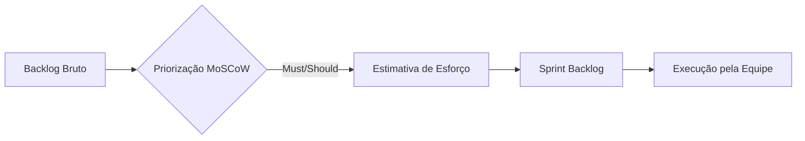

# Aula 04 – Estimativa e Priorização: O que vem primeiro?

---

## 🎯 Objetivo da Aula

- Compreender a diferença entre **Urgência** e **Importância**.
- Aprender a técnica **MoSCoW** para priorização de tarefas.
- Conhecer métodos de estimativa ágil (**T-Shirt Sizes** e **Story Points**).
- Aplicar a priorização e estimativa no backlog do projeto Pet Shop.

---

## 🏗️ A Visão do Gerente de Projetos

Como Gerente de Projetos (PM), meu maior desafio não é "o que fazer", mas **"o que NÃO fazer agora"**. Em manutenção de software, sempre haverá mais bugs e melhorias do que tempo para resolvê-los. A priorização é o que impede a equipe de entrar em colapso.

*Priorizar é filtrar o que traz mais valor para o cliente e para a saúde do sistema.*

---

## 🚦 1. Priorização: Técnica MoSCoW

Para decidir o que entra na próxima "Sprint" ou rodada de manutenção, usamos o método **MoSCoW**:

| Letra | Significado | Descrição |
| :--- | :--- | :--- |
| **M** | **Must Have** | **Tem que ter.** Essencial. Se não fizer, o sistema para (ex: erro no pagamento). |
| **S** | **Should Have** | **Deveria ter.** Importante, mas o sistema funciona sem (ex: falta de relatório). |
| **C** | **Could Have** | **Poderia ter.** Desejável, mas só se sobrar tempo (ex: mudar cor de botão). |
| **W** | **Won't Have** | **Não teremos.** Não será feito agora. Fica para o futuro. |

### Exemplo no Pet Shop:
- **Must:** Corrigir erro onde o preço do banho não aparece (Erro Crítico).
- **Should:** Adicionar foto dos novos pets.
- **Could:** Colocar uma animação ao passar o mouse na logo.

---

## 📏 2. Estimativa: Medindo o Esforço

Um erro comum é tentar estimar em **horas**. Horas são enganosas (um programador sênior faz em 1h o que um júnior faz em 4h). Por isso, estimamos a **Complexidade**.

### Técnica T-Shirt Sizes (Tamanhos de Camiseta)
É uma forma simples e visual de dar um peso para a tarefa:

- **PP (Extra Small):** Mudança de texto, trocar uma cor de CSS. (Rápido/Trivial)
- **P (Small):** Corrigir um bug simples de lógica.
- **M (Medium):** Criar uma nova tela simples ou formulário.
- **G (Large):** Integração com API externa ou refatoração de banco de dados.
- **GG (Extra Large):** Funcionalidade complexa (deve ser dividida em tarefas menores).

---

## 🛠️ O Fluxo de Trabalho do Time

---

## 🚀 Atividade Prática: Organizando a Manutenção

Vamos retomar o backlog que vocês criaram na **Aula 02** para o Pet Shop.

### Parte 1: Aplicando MoSCoW no GitHub
1. Vá até o seu quadro no **GitHub Projects** ou na lista de **Issues**.
2. Adicione **Labels** (Etiquetas) para cada tarefa:
   - `priority: MUST`
   - `priority: SHOULD`
   - `priority: COULD`
3. Justifique no comentário da Issue por que aquela tarefa é um "Must Have".

### Parte 2: Estimando Esforço
1. Para cada Issue do tipo "Must", adicione um tamanho de camiseta usando Labels (ex: `effort: P`, `effort: M`).
2. Se uma tarefa for `GG`, tente dividi-la em duas tarefas menores (Sub-issues).

---

## 🏁 Checklist do Gerente de Projetos

- [ ] Já sei o que é mais urgente? (Must)
- [ ] Já sei o que dá mais trabalho? (GG vs P)
- [ ] O time concorda com as estimativas? (Consenso é chave!)

> [!TIP]
> **Dica do PM:** Nunca prometa o "Could Have" para o cliente se o "Must Have" ainda não estiver testado e pronto!

---

> **Reflexão:** Se você tiver 5 tarefas "Must" e tempo para fazer apenas 3, o que você faria? Discutiremos isso no início da próxima aula! 💼🔥
