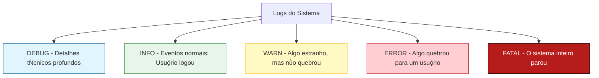

# Aula 06 – Logs e Monitoramento: Os Olhos do Sistema

---

## 🎯 Objetivo da Aula

- Compreender o que são logs e por que eles são essenciais na manutenção.
- Aprender a interpretar diferentes níveis de severidade (Log Levels).
- Entender o conceito de **Observabilidade** básica.
- Praticar a análise de "rastros" deixados por falhas.

---

## 🕵️‍♂️ Logs: A Caixa Preta do Software

Imagine que um avião cai. O que os investigadores procuram primeiro? A **Caixa Preta**. 

No software, os logs são a nossa caixa preta. Eles registram tudo o que aconteceu de importante no sistema. Sem logs, corrigir um bug em produção é como tentar resolver um crime sem pistas.

---

## 🚥 Os Níveis de Log (Log Levels)

Nem toda mensagem é igual. No mercado, usamos níveis para filtrar o que é importante:



### Qual usar e quando?
1. **INFO:** "O cliente Roberto acessou a galeria".
2. **WARN:** "Tentativa de login com senha errada 3 vezes".
3. **ERROR:** "Falha ao carregar imagem `cat.jpg` - Arquivo não encontrado".

---

## 👁️ Monitoramento vs. Observabilidade

- **Monitoramento:** É saber **QUANDO** algo quebrou (receber um alerta).
- **Observabilidade:** É saber **POR QUE** algo quebrou (olhar os logs e entender o motivo).

> **A frase do técnico:** "Eu sei que o site caiu (monitoramento), e pelos logs vi que foi porque o banco de dados ficou sem memória (observabilidade)."

---

## 🛠️ Prática: Investigando o Crime

Vamos simular uma situação no nosso projeto **Pet Shop**.

### Parte 1: Inspecionando o Navegador
1. Abra o site do Pet Shop.
2. Aperte `F12` e vá na aba **Console**.
3. Veja se há mensagens em **Vermelho** (Erro) ou **Amarelo** (Aviso).
4. Tente entender o que o navegador está "gritando" para você.

### Parte 2: A aba "Network" (Rede)
1. Vá na aba **Network**.
2. Recarregue a página (`F5`).
3. Procure por linhas vermelhas com código **404** (Não encontrado).
4. Clique na linha e veja qual arquivo o sistema tentou ler e falhou.

---

## 🚀 Desafio: Onde está o erro?

Analise este trecho de log fictício e responda: **O que causou a queda do sistema?**

```log
[2024-04-09 14:00:01] INFO: Servidor iniciado na porta 3000.
[2024-04-09 14:05:22] INFO: Usuǭrio "admin" realizou login.
[2024-04-09 14:10:45] WARN: Conexǜo com o banco lenta (> 500ms).
[2024-04-09 14:12:00] ERROR: Falha ao inserir registro na tabela 'Pets'.
[2024-04-09 14:12:01] FATAL: Banco de dados desconectado! Sistema parando...
```

---

## 🏁 Resumo da Aula

- Logs são **evidências técnicas**.
- Use níveis de log para não se perder no excesso de informação.
- O **Console** do navegador é o seu melhor amigo na manutenção front-end.

---

> [!TIP]
> **Dica de Ouro:** No seu código, nunca use `console.log("Aqui")`. Use mensagens descritivas como `console.error("Falha ao carregar API de fotos", error)`.

---

*Atividade elaborada para a UC-09 | SENAC Linhares*
