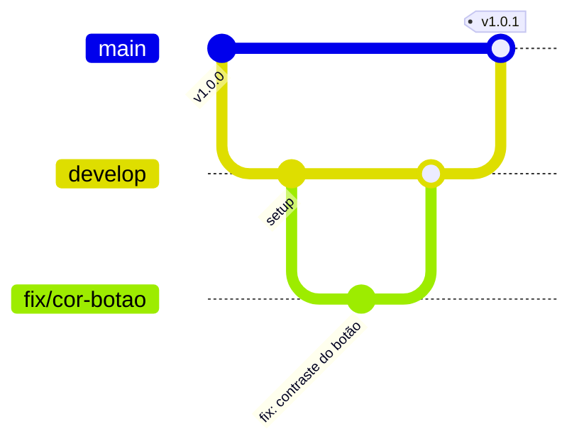

# Aula 11 – Git Profissional: PRs, Code Review e a História do Software

---

## 🎯 Objetivo da Aula

- Dominar o fluxo de **Branches** para manutenção.
- Aprender a escrever **Commits Semânticos** (Padrão de Mercado).
- Realizar revisões de código (**Code Review**) construtivas.
- Criar e manter um **Changelog** profissional.

---

## 🌳 1. Git Flow para Manutenção

Trabalhar na `main` é um erro fatal em manutenção. Imagine quebrar o site enquanto tenta consertar um bug! Usamos branches para isolar o trabalho:



### Nomenclatura Recomendada:
- `fix/nome-do-bug`: Para correções imediatas.
- `feat/nova-funcao`: Para novas funcionalidades.
- `docs/atualizacao`: Para melhorias na Wiki ou README.

---

## ✉️ 2. Commits Convencionais (Conventional Commits)

Grandes empresas usam padrões de commit para gerar logs automaticamente. O formato é:
`<tipo>: <descrição curta>`

| Tipo | Quando usar | Exemplo |
| :--- | :--- | :--- |
| **fix:** | Correção de bug. | `fix: corrige link quebrado no rodapé` |
| **feat:** | Nova funcionalidade. | `feat: adiciona botão de contato via whatsapp` |
| **docs:** | Mudança apenas em docs. | `docs: atualiza guia de instalação no readme` |
| **style:** | Mudanças visuais/CSS. | `style: ajusta espaçamento entre cards de pets` |
| **chore:** | Tarefas repetitivas. | `chore: atualiza dependência do bootstrap` |

> [!IMPORTANT]
> **Evite Commits Genéricos:** Nunca use "ajustes", "arrumando", "fix". Seja específico!

---

## 🔍 3. O Ritual do Pull Request (PR)

Um PR não é apenas um "pedido para juntar o código". É o momento de **revisão por pares**.

### O que um bom PR deve ter:
1. **Rastreabilidade:** Link para a Issue (ex: `Fixes #45`).
2. **Contexto:** Por que essa mudança foi feita?
3. **Evidências:** Prints do antes e depois.

### Etiqueta no Code Review (Como revisar):
- **Não critique a pessoa, critique o código.**
- Em vez de "Seu código está ruim", diga: *"O que você acha de usarmos esta outra função aqui para ganhar performance?"*.
- Use o sistema de aprovação: `Approve`, `Comment` ou `Request Changes`.

---

## 📜 4. Keep A Changelog (Sempre Informe o Usuário)

O **Changelog** é o diário de bordo do software. Ele comunica o valor que a equipe de manutenção entregou.

### Padrão SemVer (Versoneamento Semântico): `1.2.3`
- **1 (MAJOR):** Mudanças grandes que quebram tudo.
- **2 (MINOR):** Novas funções que não quebram o código antigo.
- **3 (PATCH):** Apenas correções de bugs.

### Exemplo de Changelog:
```markdown
## [2.1.0] - 2024-04-09
### Added
- Botão flutuante de WhatsApp no canto inferior direito.
- Galeria de imagens na seção 'Clientes Felizes'.

### Fixed
- Contraste do formulário de contato (Acessibilidade WCAG).
- Erro de digitação na seção 'Quem Somos'.
```

---

## 🚀 Atividade Prática: O Ciclo Completo

1. **Crie uma Branch**: `fix/correcao-texto` ou similar.
2. **Faça a alteração**: Corrija algum detalhe no seu projeto Pet Shop.
3. **Commit Semântico**: Use o padrão `fix: ...`.
4. **Abra um PR**: Use o template profissional que configuramos.
5. **Code Review**: Troque de lugar com o colega ao lado. Você deve revisar o PR dele e ele o seu.
6. **Merge & Version**: Após aprovação, faça o merge e atualize o **Changelog.md**.

---

## 🏁 Checklist Profissional

- [ ] Minha branch tem nome claro?
- [ ] Meu commit segue o padrão convencial?
- [ ] Meu PR tem prints/evidências?
- [ ] Eu revisei o código de alguém hoje?

---

> **Reflexão:** "Um código sem log é um código sem história. Um código sem PR é um código sem segurança." 💼🛡️
