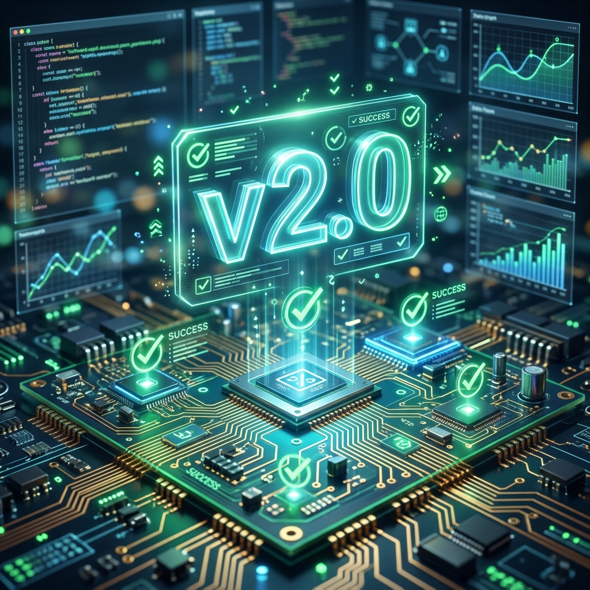

# SA-02: Documentação de Entrega e Retrospectiva da Manutenção

**Unidade Curricular:** UC-09 — Atualização e Manutenção de Software  
**Projeto:** Pet Shop Patas Felizes (Pós-Correções)  
**Objetivo:** Consolidar o conhecimento sobre o sistema após as correções e avaliar o processo de gestão.

---

## 📢 Cenário: Missão Cumprida... e Agora?

Equipe, parabéns pelo excelente trabalho técnico! O site do **Pet Shop Patas Felizes** foi atualizado, os bugs críticos de acessibilidade e imagens foram resolvidos e as novas funcionalidades (WhatsApp e Galeria) estão operacionais. O cliente Roberto Abreu está satisfeito com o resultado visual.

No entanto, para o mundo profissional, **o trabalho não acaba no código**. Se o sistema precisar de uma nova manutenção daqui a um ano, como saberemos o que foi feito? Como garantimos que o próximo desenvolvedor não cometa os mesmos erros?

Sua missão agora é realizar a **Documentação de Entrega** e a **Retrospectiva de Gestão**.

---

## 🛠️ Tarefa 1: Documentação Reversa (Post-Mortem)

Como vocês já aplicaram as correções, agora devem documentar o estado atual do sistema para garantir sua sustentabilidade.

### 1.1 Criar o Changelog (Wiki GitHub)
Na Wiki do repositório, crie uma página chamada `Changelog - v2.0`.
- Liste todas as melhorias e correções realizadas.
- Para cada item, cite o número da **Issue** correspondente (ex: `Fix #12`).
- Explique brevemente **como** o erro foi resolvido tecnicamente (ex: "Troca de cores hexadecimais para atender contraste WCAG").

### 1.2 Atualizar o Manual do Desenvolvedor (Wiki GitHub)
Documente as novas funcionalidades para que outros saibam como mantê-las:
- **Botão WhatsApp:** Qual link e número foram configurados?
- **Galeria de Fotos:** Como adicionar uma nova foto nela?
- **Estilos:** Quais são as cores e fontes oficiais agora definidas?

---

## 🏗️ Tarefa 2: Retrospectiva de Estimativa vs. Realidade

Na Aula 04, falamos sobre priorização e esforço. Agora que o trabalho foi feito, vamos comparar o que achávamos com o que realmente aconteceu.

### 2.1 Análise de Esforço
Escolham 3 Issues que vocês fecharam e preencham a tabela abaixo no seu relatório:

| Issue | Estimativa Inicial (T-Shirt) | Esforço Real Sentido | O que dificultou/facilitou? |
| :--- | :--- | :--- | :--- |
| Ex: #15 (WhatsApp) | `P` | `M` | Tivemos dificuldade em posicionar o botão fixo no mobile. |
| | | | |
| | | | |

### 2.2 Classificação Pós-Entrega
Se tivessem que fazer tudo de novo, mudariam a prioridade de alguma tarefa? O que trouxe mais valor imediato para o Roberto?

---

## 📅 Entrega Final

A entrega desta SA consiste em:
1. **Wiki do GitHub** atualizada com: `Home`, `Changelog v2.0` e `Manual do Desenvolvedor`.
2. **README.md** com um resumo da entrega e links para a Wiki.
3. **Issues Fechadas:** Todas as issues no GitHub devem estar com o status de `Closed`, vinculadas ao Milestone e com os comentários finais da resolução.

---

## 📊 Critérios de Avaliação

| Critério | Excelente (10) | Regular (5) | Insuficiente (0) |
| :--- | :--- | :--- | :--- |
| **Rastreabilidade** | Todas as alterações são rastreáveis via Issues e Changelog. | Algumas alterações foram feitas sem registro formal. | Sem registro de alterações. |
| **Manual Técnico** | Documentação clara que permite um novo dev manter o sistema. | Documentação superficial ou incompleta. | Sem manual técnico. |
| **Visão Crítica** | Retrospectiva honesta sobre as dificuldades e erros de estimativa. | Retrospectiva rasa ou puramente teórica. | Não realizou a retrospectiva. |

---

> [!IMPORTANT]
> **Lição de Carreira:** Manutenção de software é um ciclo. Documentar o que foi feito hoje poupa horas de desespero amanhã.

---

*Atividade elaborada para a UC-09 | SENAC Linhares*
