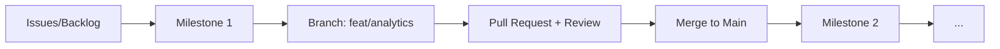

# SA-Final: Evolução Fullstack

**Unidade Curricular:** UC-09 — Atualização e Manutenção de Software  
**Projeto:** Pet Shop Patas Felizes (Fase 3: Expansão)  
**Nível:** Desenvolvedor Júnior (FullStack)

---

## 🗒️ Ata de Reunião #03 — Planejamento de Expansão

**Data:** 10 de Abril de 2024  
**Participantes:** Roberto Abreu (Cliente), Equipe de Desenvolvimento (Alunos).

Roberto Abreu está extremamente satisfeito com as correções visuais, mas agora ele quer transformar o site em uma ferramenta de negócios real. Durante a reunião, ele apresentou as seguintes necessidades:

1.  **Monitoramento de Comportamento:** Roberto quer saber quantos usuários visitam o site e "onde eles clicam". Ele solicitou a integração com **Google Analytics** e **Microsoft Clarity**.
2.  **Persistência de Leads:** Atualmente, o formulário de contato "não faz nada". Ele quer que todos os nomes, e-mails e mensagens dos clientes sejam salvos em um banco de dados para que ele possa entrar em contato depois.
3.  **Painel Administrativo (CMS):** O dono da loja quer autonomia. Ele quer uma área protegida onde ele mesmo possa:
    - Ler as mensagens recebidas.
    - Trocar as fotos da galeria de "Antes e Depois".
    - Atualizar os depoimentos dos clientes.

---

## 🛠️ O Desafio Técnico

Como Desenvolvedor Júnior, sua tarefa é planejar e executar essa atualização seguindo os padrões de arquitetura e governança de código da empresa.

### 1. Arquitetura do Sistema
Vocês devem construir uma **Web API em .NET** seguindo o padrão **MVC** (Model-View-Controller) ou **Clean Architecture** para gerenciar as operações de banco de dados (MySQL).

### 2. Governança e Git
Toda a evolução deve ser rastreável. Não é permitido codar tudo de uma vez. Vocês devem:
- **Gestão de Tarefas:** Criar **Issues** detalhadas para cada sub-tarefa e utilizar um **GitHub Project (Kanban)** para organizar o fluxo de trabalho (To Do, In Progress, Done).
- **Marcos (Milestones):** Organizar o Backlog em **3 Milestones** no GitHub.
- **Branches:** Criar **uma Branch separada** para cada Milestone.
- **Pull Requests:** Ao finalizar cada Milestone, abrir um **Pull Request (PR)** usando o modelo `git-templates/pr-template.md`.

### 3. Gestão do Conhecimento (Wiki)
Seguindo o padrão de excelência da SA-02, ao final do projeto as novas funcionalidades devem ser documentadas na **Wiki do GitHub**:
- Atualizar o **Mapa do Sistema** com a nova arquitetura .NET.
- Documentar os novos endpoints da API no **Manual do Desenvolvedor**.
- Atualizar o **Changelog** para a versão `v3.0.0`.

---

## 🗺️ Roadmap de Implementação (Os 3 Milestones)

### Milestone 1: Inteligência e Telemetria (`feat/analytics`)
- Inserir os scripts de integração do Google Analytics e Microsoft Clarity no `<head>` do projeto.
- Validar se os dados estão sendo enviados corretamente (usando a aba Network/Console).
- **Entrega:** PR aprovado e Merge na branch principal.

### Milestone 2: Persistência de Leads (`feat/backend-contatos`)
- Criar o banco de dados `db_patas_felizes`.
- Criar a API em .NET para o endpoint `POST /contatos`.
- Integrar o formulário HTML (JavaScript `fetch`) com a nova API.
- **Entrega:** PR aprovado mostrando o salvamento funcionando.

### Milestone 3: Área Administrativa (`feat/cms-admin`)
- Criar endpoints de `GET` e `DELETE` para contatos.
- Criar endpoints para gerenciar a galeria de imagens.
- Criar uma página HTML simples de "Login" e "Dashboard" para o Roberto Abreu.
- **Entrega:** PR final com o sistema completo.

---

## 📊 Fluxo de Trabalho (Workflow)

---

## ✅ Critérios de Sucesso

| Critério | Descrição | Peso |
| :--- | :--- | :--- |
| **Padrão MVC** | O código .NET está organizado em Models, Controllers e Services? | 3.0 |
| **Integração Front/Back** | O formulário salva os dados no banco real sem erros? | 3.0 |
| **Governança Git** | Foram usados Commits Semânticos e os 3 PRs com o template? | 2.0 |
| **Monitoramento** | Os scripts de Analytics e Clarity estão injetados corretamente? | 2.0 |

---

> [!SUCCESS]
># 🏆 Parabéns!
>Se você chegou até aqui e concluiu as 3 Situações de Aprendizagem (SA), você não apenas "fez um backend" ou "consertou bugs". Você simulou o **processo completo de entrega de software** de uma empresa profissional. 

Você demonstrou competência em:
1. **Investigação Técnica** (Bugfixing).
2. **Gestão de Conhecimento** (Wiki e Documentação).
3. **Governança de Código** (Git Flow, PRs e Milestones).
4. **Evolução de Produto** (Backend .NET e Analytics).

Você está pronto para o mercado! **🚀🛡️🐾**

---

*Atividade Final da UC-09 — Desenvolvida para SENAC Linhares*

---
